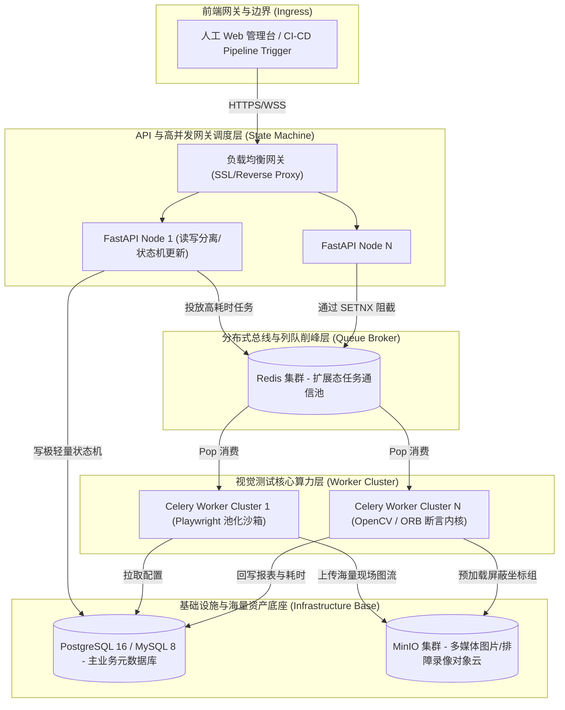
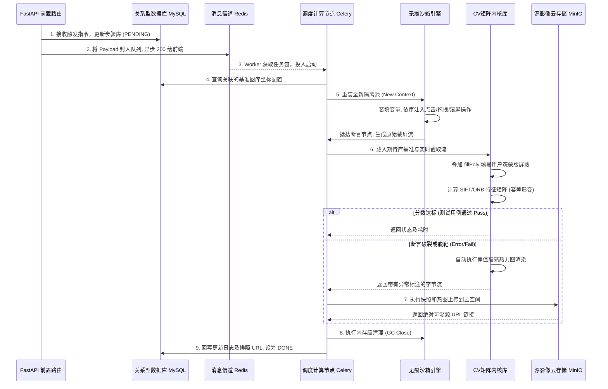
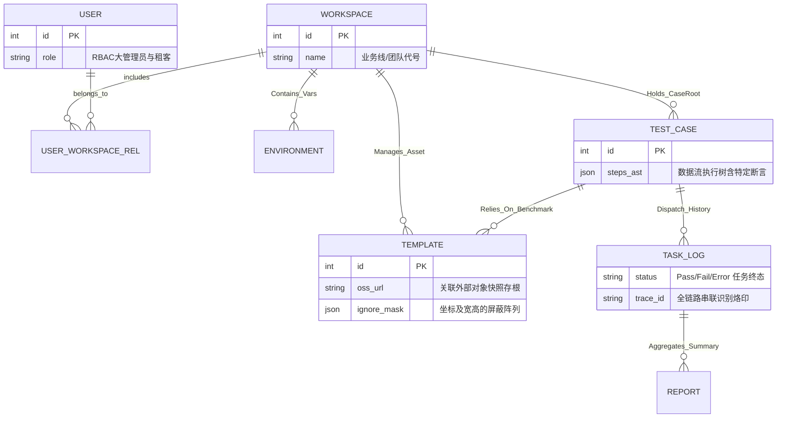

# 视觉自动化测试平台 - 服务端技术架构设计文档

## 1. 架构生态与技术选型
- **底层语言**：Python 3.11 (统一与 MVP 技术基线，享受完善的类型注解与异步特性)
- **Web 框架**：FastAPI (异步无阻塞，Pydantic 高强校验模型，开箱自带 OpenAPI / Swagger)
- **调度/并发引擎**：MVP 默认采用 `FastAPI BackgroundTasks + asyncio`，定时任务可选 `APScheduler`；企业级扩展态升级为 `Celery + Redis`，用于批量并发执行与削峰
- **关系数据层**：SQLAlchemy 2.0 (ORM抽象) + Alembic (表结构数据迁移引擎)
  - MVP 默认主库：PostgreSQL 16 单实例
  - 企业级兼容：MySQL 8.x
  - 极简化/本地演示：SQLite（仅限本地体验，不建议作为正式环境主库）
- **海量媒体资产存储层**：S3 协议兼容的对象存储 (MinIO / OSS) - 彻底剥离高频原始截图带来的磁盘 I/O 灾难爆炸。
- **浏览器驱动控制引擎**：Playwright-Python (无需额外安装外部 WebDriver，天然支持多并发无痕隔离沙箱 Context)
- **计算机视觉内核**：OpenCV-Python (用于大图寻址、矩阵运算、抗拉伸防震特征聚类 SIFT/ORB) + PaddleOCR (文本框标定检查)

> 说明：本文档用于描述后端高层架构与关键链路。API 资源契约以 `doc/api/` 分模块文档为准；数据库物理模型以 `doc/database/` 分模块文档为准。下文架构图以“可平滑扩展的企业级部署形态”为主，MVP 可退化为单进程或单容器部署。

## 2. 核心架构拓扑大盘与模块隔离机制 (System Architecture)

作为支撑千人研发测试、具有极强伸缩调度能力的企业级断言平台，整个后端通过“快读慢做”剥离成 `网关状态机层` 和 `计算内核集群池` 双核心。MVP 阶段可先将 `Nginx / Redis / Worker Cluster` 收敛为单体服务内模块化部署：

## 3. 核心设计与执行时序流转链路

### 3.1 跨端视觉断言流转方向拆解时序图 (Core Engine Sequence Flow)
这是整个服务端的“核反应堆”。它描述了在夜间一次多达上百用例的高并发回归套件触发后，各个集群单元如何配合从“组队”经过“断言”最终“产生高亮排障反馈”的极限周转过程：

### 3.2 强隔离企业级领域模型联系图 (Database ER Diagram)
架构层面的数据软隔离不仅能在代码层保障安全，更决定了后期的 SQL 处理性能：

> 说明：下图是概念模型，强调领域关系与边界；实际落地时不直接使用 `steps_ast`、`ignore_mask` 这类大 JSON 作为唯一存储模型，物理表设计以拆分后的数据库文档为准。

## 4. 高可用、熔断与全链路可观测体系 (Observability & SLA)

### 4.1 全链路 Trace-ID 日志追踪串联
- **盲盒排错痛点破除**：由 HTTP 触发，抛入 Redis 队列，被任意 Celery 节点消费执行的超长生命周期流程根本无从排查。
- **全局链路染色**：FastAPI 提供网关层唯一 `Trace-ID`。将其作为 `kwargs` 透传携带进任务队列深处。所有 OpenCV 计算警告及无头浏览器操作的报错调用系统级 `Loguru` 写入带有这枚 ID 的结构化 JSON 日志。当某个测试红了，开发者用此 ID 能一键拼凑起跨多台容器的全程真相。

### 4.2 API 资源防抖与重复跑批限流
- 对于类似 CI WebHooks 或人工手抖引发的高频重复点按触发批次跑回归，利用 Redis `SETNX` 创建锁建立分布式风暴拦截网，阻止浪费昂贵的 UI 渲染算力。

### 4.3 终极熔断隔离阀 (Worker Memory Re-cycling GC)
- 设定严酷的 `max_tasks_per_child` 轮换重启机制（打底阀）。如每渲染处理过 50 个高压的测试流程，强行销毁该 `Celery Worker` 进程和它内部牵连挂载的 Playwright 内存节点，并自动拉起彻底干净的新守护进程。杜绝了一切 Chromium 隐性内存泄漏吞噬主机的可能，确立了系统的硬边界高 SLA 防线。
