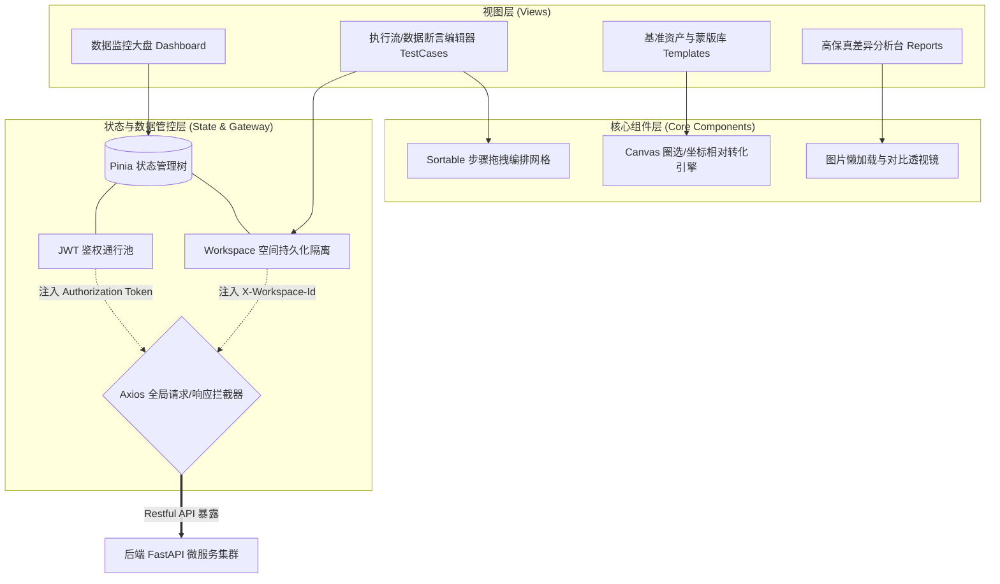
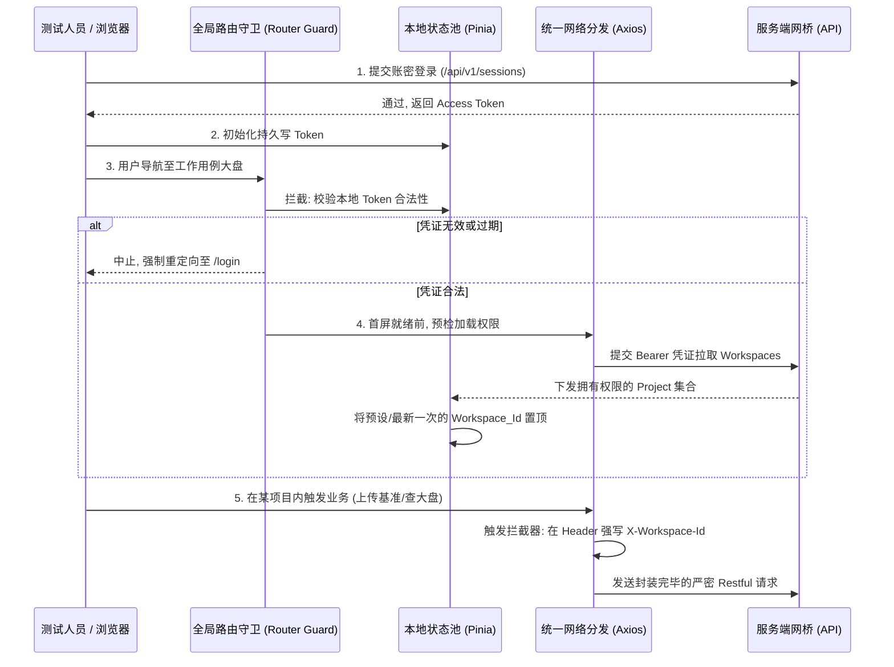
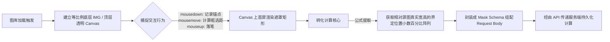

# 视觉自动化测试平台 - 前端技术架构设计文档

## 1. 架构选型与核心生态
- **核心框架**：Vue 3 (Composition API)
- **构建工具**：Vite（极速冷启动，按需编译，热重载快）
- **UI 组件库**：Element Plus（默认组件库，提供表格、弹窗、表单等基础企业级能力）
- **CSS 框架**：Tailwind CSS（原子类，高度定制样式，契合 AI 辅助生成代码）
- **状态管理**：Pinia（替代 Vuex，轻量且完全拥抱 TypeScript，支持扁平化 store）
- **路由管理**：Vue Router 4
- **网络请求**：Axios（封装请求拦截、Token刷新、统一全局错误处理）
- **前端本地存储**：VueUse (提供 `useStorage` 持久化管理 Token/当前工作区)
- **画布/截图交互核心引擎**：Canvas API / Fabric.js（用于实现图片局部蒙版画框、坐标回溯）

> 说明：前端与后端对接时，请统一以 `doc/api/` 下的 RESTful API 契约文档为准，避免仅依据高层架构图自行推断请求路径与响应结构。

## 2. 核心架构与模块可视化联系图 (Architecture Diagram)

前台采用标准的 SPA (单页应用) 体系。核心业务视图通过依赖分离的“组件”与“引擎”来完成复杂的图像蒙板绘制与拖拽逻辑编排：

## 3. 核心业务交互与数据流转链路 (Data Flow)

### 3.1 用户鉴权与工作空间隔离 (Workspace & Auth Sequence)

为彻底解决企业多部门、多项目组数据错乱的越权风险，平台在初始化加载第一帧页面时即约束严苛的拦截保护流转：

### 3.2 难点：可视化“忽略屏蔽区域 (Ignore Regions)”处理链路流转

由于不同设备上传的模板图片存在巨大宽高差，纯依靠 DOM 控制坐标会导致引擎对切片缩放失效。前端必须以“原图物理宽高的相对百分比”结构提交坐标点阵：

## 4. 性能优化、协同规范与本地容灾边界 (DX & UX)

### 4.1 核心性能防崩调优 (Performance)
- **路由代码块分割 (Route Lazy Loading)**：对 TestCases 编辑器这样牵扯拖拽等数百个第三方库的页面实施路由懒加载 (`const Foo = () => import('./Foo.vue')`)，确保平台外壳及大盘在第一秒极速直出。
- **海量报表图片懒加载 (Intersection Observer)**：因为高并发的 Nightly 巡检报告往往长达数百帧高清排异报错图，使用虚拟滚轮或 `` 视口监控卸载组件，防范 DOM 节点爆破引发前端浏览器物理上的 OOM。

### 4.2 本地研发体验降级保障 (DX Mocking)
- 依靠 `MSW` 或 `Vite Mock 插件` 完成了网络层的完全屏蔽切片。在这个企业级项目中，当团队要调测极其复杂的组件化、拖拽、Canvas 数据拼装反馈时，哪怕后端的厚重 OpenCV + Python+ Playwright 环境没有被开发者机器拉起，依然可以借用 Mock 返回的测试驱动实现 90% 以上的大前端交互验证。

### 4.3 全局容灾降级防护墙 (Error Boundary & Tracker)
- **挂载降级 UI 组件**：重度引入 Vue 的 `app.config.errorHandler`。遭遇网络波动或数据树断裂时，利用边界组件顶替页面主体，友善提示而非白屏。
- **暗箱溯源链路存储**：静默以队列形式抛除和记录最后 10 步浏览器点击路径及路由栈，当发生 Error 时将堆栈连同上报，极大方便在前端拖拽与逻辑极度复杂的场景下复现和查障。
